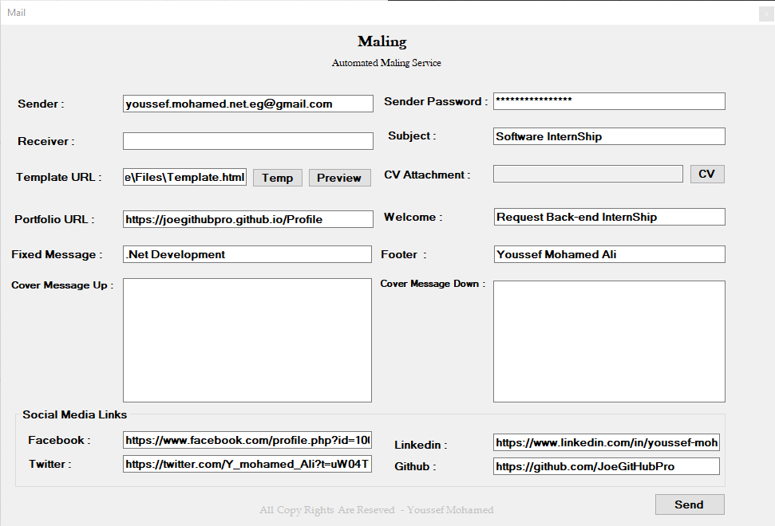
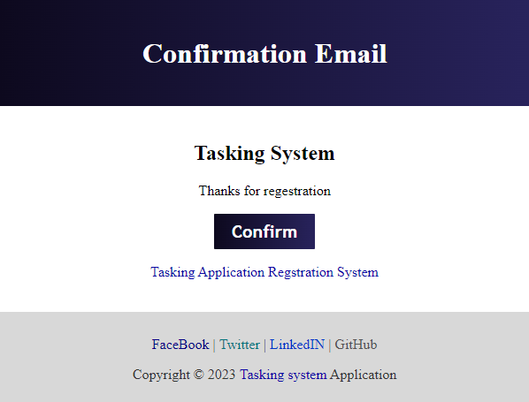

  # Welcome to Mail Sender 👋

<p align="center"></p>

  <h2>About</h2>
  <p>Mail Sender App.</p>

  <h2>Installation</h2>
  <p>1. Install Repo </p>

```
https://github.com/JoeGitHubPro/MailService
```


<p>3. Run Application</p>

  <h2>Usage</h2>
  
  <p>Main window.</p>
  <p align="center"></p>
    
  <p>Email template.</p>
  <p align="center"></p>  
  

   <h2>Contributing</h2>
  <p>Contributions are welcome! If you'd like to contribute to this project, please follow these steps:</p>
  <ol>
    <li>Fork the repository.</li>
    <li>Create a new branch for your feature or bug fix.</li>
    <li>Make your changes and commit them.</li>
    <li>Push your changes to your forked repository.</li>
    <li>Submit a pull request detailing your changes.</li>
  </ol>
  
  <h2>License</h2>
  <p>This project is licensed under the MIT</p>

  <h2>Contact</h2>
  <p>If you have any questions or suggestions, feel free to reach out to the project owner:</p>
  <ul>
    <li>GitHub: <a href="https://github.com/JoeGitHubPro">JoeGitHubPro</a></li>
  </ul>

  <h2>Acknowledgments</h2>
  <p>C# , WinForm , OOP .</p>

  <h2>Repository</h2>
  <p>Find the repository for this project on GitHub: <a href="https://github.com/JoeGitHubPro/MailService.git">MailService</a></p>
